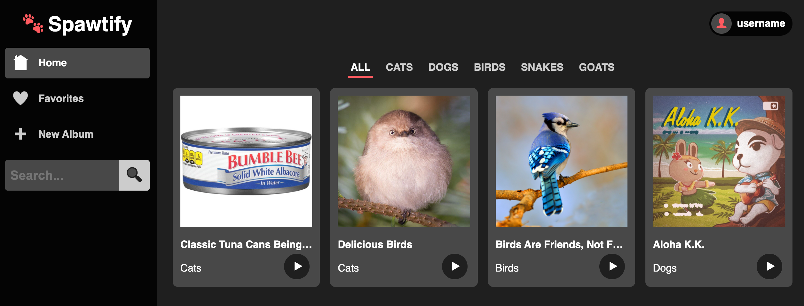
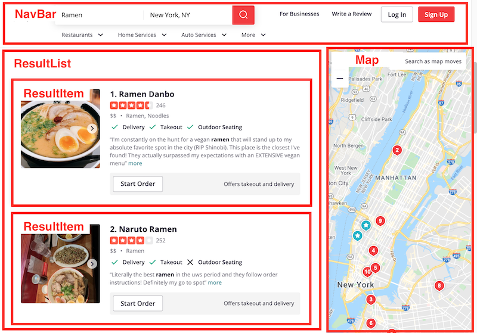

# Discussion Questions: Components

Get together in groups and clone down this repository. Your goal for this discussion question is to recreate the app in this demo image:



The components are already provided for you, it's your job to put them all together!

Start by discussing the image of the demo app and decide what components belong
where. For example, here's how you might break up a site like Yelp into
components:



Once you've decided on your component hierarchy, it's time to start coding!,
Starting from the `App` component, add all the necessary components in place.
For example, if you decided to put the `TopMenu` in the `App` component, here's
how it would look:

```js
import React from "react";
import TopMenu from "./TopMenu";

function App() {
  return (
    <div className="app-container">
      <TopMenu />
    </div>
  );
}

export default App;
```

## Bonus

If you finish early, have a look at the `AlbumList` component. You'll notice there is an array of album data being imported in this file:

```js
import { albums } from "../data/albums";
```

See if you can use this array to dynamically generate the `Album` components
instead of hard-coding them.
